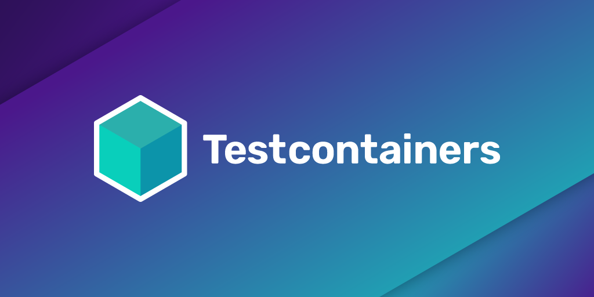

# Testcontainers



## About

Testcontainers is a Java library that supports JUnit tests, providing lightweight, throwaway instances of common databases, Selenium web browsers, or anything else that can run in a Docker container.

Testcontainers make the following kinds of tests easier:

* **Data access layer integration tests**: use a containerized instance of a MySQL, PostgreSQL or Oracle database to test your data access layer code for complete compatibility, but without requiring complex setup on developers' machines and safe in the knowledge that your tests will always start with a known DB state. Any other database type that can be containerized can also be used.
* **Application integration tests**: for running your application in a short-lived test mode with dependencies, such as databases, message queues or web servers.
* **UI/Acceptance tests**: use containerized web browsers, compatible with Selenium, for conducting automated UI tests. Each test can get a fresh instance of the browser, with no browser state, plugin variations or automated browser upgrades to worry about. And you get a video recording of each test session, or just each session where tests failed.
* **Much more!** Check out the various contributed modules or create your own custom container classes using [`GenericContainer`](features/creating_container.md) as a base.

## Prerequisites

* Docker - please see [General Docker requirements](supported_docker_environment/index.md)
* A supported JVM testing framework:
    * [JUnit 4](test_framework_integration/junit_4.md) - See the [JUnit 4 Quickstart Guide](quickstart/junit_4_quickstart.md)
    * [Jupiter/JUnit 5](test_framework_integration/junit_5.md)
    * [Spock](test_framework_integration/spock.md)
    * *Or* manually add code to control the container/test lifecycle (See [hints for this approach](test_framework_integration/junit_4.md#manually-controlling-container-lifecycle))

## Maven dependencies

Testcontainers is distributed as separate JARs with a common version number:

* A core JAR file for core functionality, generic containers and docker-compose support
* A separate JAR file for each of the specialised modules. Each module's documentation describes the Maven/Gradle dependency to add to your project's build.

For the core library, the latest Maven/Gradle dependency is as follows: 

```groovy tab='Gradle'
testImplementation "org.testcontainers:testcontainers:{{latest_version}}"
```

```xml tab='Maven'
<dependency>
    <groupId>org.testcontainers</groupId>
    <artifactId>testcontainers</artifactId>
    <version>{{latest_version}}</version>
    <scope>test</scope>
</dependency>
```

You can also [check the latest version available on Maven Central](https://search.maven.org/#search%7Cga%7C1%7Cg%3A%22org.testcontainers%22).

### Managing versions for multiple Testcontainers dependencies

To avoid specifying the version of each dependency, you can use a `BOM` or `Bill Of Materials`.

Using Maven you can add the following to `dependencyManagement` section in your `pom.xml`:

```xml tab='Maven'
<dependencyManagement>
    <dependencies>
        <dependency>
            <groupId>org.testcontainers</groupId>
            <artifactId>testcontainers-bom</artifactId>
            <version>{{latest_version}}</version>
            <type>pom</type>
            <scope>import</scope>
        </dependency>
    </dependencies>
</dependencyManagement>
```
and then use dependencies without specifying a version:

```xml tab='Maven'
<dependency>
    <groupId>org.testcontainers</groupId>
    <artifactId>mysql</artifactId>
    <scope>test</scope>
</dependency>
```

Using Gradle 5.0 or higher, you can add the following to the `dependencies` section in your `build.gradle`:

```groovy tab='Gradle'
implementation platform('org.testcontainers:testcontainers-bom:{{latest_version}}') //import bom
testImplementation('org.testcontainers:mysql') //no version specified
```


[JitPack](jitpack_dependencies.md) builds are available for pre-release versions.

!!! warning "Shaded dependencies"
    Testcontainers depends on other libraries (like docker-java) for it to work.  
    Some of them (JUnit, docker-java-{api,transport} and its transitive dependencies, JNA, visible-assertions and others) are part of our public API.  
    But there are also "private", implementation detail dependencies (e.g. docker-java-core, Guava, OkHttp, etc etc) that are not exposed to public API but prone to conflicts with test code/application under test code. 
    As such, **these libraries are 'shaded' into the core testcontainers JAR** and relocated under `org.testcontainers.shaded` to prevent class conflicts.

## Sponsors

Testcontainers is on Github Sponsors! Please consider sponsoring us to sustain the project and help us improve it further.

<iframe src="https://github.com/sponsors/testcontainers/button" title="Sponsor Testcontainers" height="35" width="107" style="border: 0;"></iframe>

A huge thank you to our sponsors:

### Bronze sponsors

<div style="text-align:center; max-width: 128px; display: inline-block; margin: 5px;">
    <a href="https://cirrus-ci.org/">
        
        <p>Cirrus CI</p>
        <!-- via fkorotkov's sponsorship -->
    </a>
</div>

<div style="text-align:center; max-width: 128px; display: inline-block; margin: 5px;">
    <a href="https://vivy.com">
        
        <p>Vivy</p>
    </a>
</div>

<div style="text-align:center; max-width: 128px; display: inline-block; margin: 5px;">
    <a href="https://www.jooq.org/">
        
        <p>jOOQ</p>
    </a>
</div>

<div style="text-align:center; max-width: 128px; display: inline-block; margin: 5px;">
    <a href="https://www.backbase.com/">
        
        <p>Backbase</p>
    </a>
</div>

### Backers

* [Philip Riecks (@rieckpil)](https://github.com/rieckpil)
* [Karl Heinz Marbaise (@khmarbaise)](https://github.com/khmarbaise)
* [Sascha Frinken (@sascha-frinken)](https://github.com/sascha-frinken)
* [Christoph Dreis (@dreis2211)](https://github.com/dreis2211)
* [Pascal Zwick (@pas2al)](https://github.com/pas2al)
* [Nikita Zhevnitskiy (@zhenik)](https://github.com/zhenik)
* [Bas Stoker (@bastoker)](https://github.com/bastoker)

## Who is using Testcontainers?

* [ZeroTurnaround](https://zeroturnaround.com) - Testing of the Java Agents, micro-services, Selenium browser automation
* [Zipkin](https://zipkin.io) - MySQL and Cassandra testing
* [Apache Gora](https://gora.apache.org) - CouchDB testing
* [Apache James](https://james.apache.org) - LDAP and Cassandra integration testing
* [StreamSets](https://github.com/streamsets/datacollector) - LDAP, MySQL Vault, MongoDB, Redis integration testing
* [Playtika](https://github.com/Playtika/testcontainers-spring-boot) - Kafka, Couchbase, MariaDB, Redis, Neo4j, Aerospike, MemSQL
* [JetBrains](https://www.jetbrains.com/) - Testing of the TeamCity plugin for HashiCorp Vault
* [Plumbr](https://plumbr.io) - Integration testing of data processing pipeline micro-services
* [Streamlio](https://streaml.io/) - Integration and Chaos Testing of our fast data platform based on Apache Puslar, Apache Bookeeper and Apache Heron.
* [Spring Session](https://projects.spring.io/spring-session/) - Redis, PostgreSQL, MySQL and MariaDB integration testing
* [Apache Camel](https://camel.apache.org) - Testing Camel against native services such as Consul, Etcd and so on
* [Infinispan](https://infinispan.org) - Testing the Infinispan Server as well as integration tests with databases, LDAP and KeyCloak
* [Instana](https://www.instana.com) - Testing agents and stream processing backends
* [eBay Marketing](https://www.ebay.com) - Testing for MySQL, Cassandra, Redis, Couchbase, Kafka, etc.
* [Skyscanner](https://www.skyscanner.net/) - Integration testing against HTTP service mocks and various data stores
* [Neo4j-OGM](https://neo4j.com/developer/neo4j-ogm/) - Testing new, reactive client implementations
* [Lightbend](https://www.lightbend.com/) - Testing [Alpakka Kafka](https://doc.akka.io/docs/alpakka-kafka/current/) and support in [Alpakka Kafka Testkit](https://doc.akka.io/docs/alpakka-kafka/current/testing.html#testing-with-kafka-in-docker)
* [Zalando SE](https://corporate.zalando.com/en) - Testing core business services
* [Europace AG](https://tech.europace.de/) - Integration testing for databases and micro services
* [Micronaut Data](https://github.com/micronaut-projects/micronaut-data/) - Testing of Micronaut Data JDBC, a database access toolkit
* [Vert.x SQL Client](https://github.com/eclipse-vertx/vertx-sql-client) - Testing with PostgreSQL, MySQL, MariaDB, SQL Server, etc.
* [JHipster](https://www.jhipster.tech/) - Couchbase and Cassandra integration testing
* [wescale](https://www.wescale.com) - Integration testing against HTTP service mocks and various data stores
* [Marquez](https://marquezproject.github.io/marquez) - PostgreSQL integration testing
* [Wise (formerly TransferWise)](https://wise.com) - Integration testing for different RDBMS, kafka and micro services
* [XWiki](https://xwiki.org) - [Testing XWiki](https://dev.xwiki.org/xwiki/bin/view/Community/Testing/DockerTesting/) under all [supported configurations](https://dev.xwiki.org/xwiki/bin/view/Community/SupportStrategy/)
* [Apache SkyWalking](http://github.com/apache/skywalking) - End-to-end testing of the Apache SkyWalking, and plugin tests of its subproject, [Apache SkyWalking Python](http://github.com/apache/skywalking-python), and of its eco-system built by the community, like [SkyAPM NodeJS Agent](http://github.com/SkyAPM/nodejs)
* [jOOQ](https://www.jooq.org) - Integration testing all of jOOQ with a variety of RDBMS
* [Trino (formerly Presto SQL)](https://trino.io) - Integration testing all Trino core & connectors, including tests of multi-node deployments and security configurations.
* Google - Various open source projects: [OpenTelemetry](https://github.com/GoogleCloudPlatform/opentelemetry-operations-java), [Universal Application Tool](https://github.com/seattle-uat/universal-application-tool), [CloudBowl](https://github.com/GoogleCloudPlatform/cloudbowl-microservice-game)
* [Backbase](https://www.backbase.com/) - Unit, Integration and Acceptance testing for different the databases supported (Oracle, SQL Server, MySQL), the different messaging systems supported (Kafka, Rabbit, AMQ) and other microservices and HTTP mocks.


## License

See [LICENSE](https://raw.githubusercontent.com/testcontainers/testcontainers-java/master/LICENSE).

## Attributions

This project includes a modified class (ScriptUtils) taken from the Spring JDBC project, adapted under the terms of the Apache license. Copyright for that class remains with the original authors.

This project was initially inspired by a [gist](https://gist.github.com/mosheeshel/c427b43c36b256731a0b) by [Moshe Eshel](https://github.com/mosheeshel).

## Copyright

Copyright (c) 2015-2021 Richard North and other authors.

See [AUTHORS](https://raw.githubusercontent.com/testcontainers/testcontainers-java/master/AUTHORS) for contributors.
