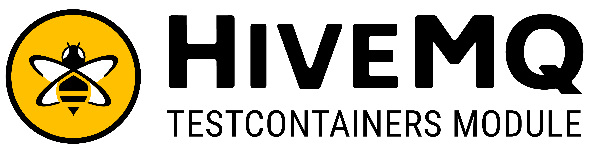

# HiveMQ Module



Automatic starting HiveMQ docker containers for JUnit4 and JUnit5 tests.
This enables testing MQTT client applications and integration testing of custom HiveMQ extensions.

- Community forum: https://community.hivemq.com/
- HiveMQ website: https://www.hivemq.com/
- MQTT resources:
    - [MQTT Essentials](https://www.hivemq.com/mqtt-essentials/)
    - [MQTT 5 Essentials](https://www.hivemq.com/mqtt-5/)
    
Please make sure to check out the hivemq-docs for the [Community Edition](https://github.com/hivemq/hivemq-community-edition/wiki/) 
and the [Enterprise Edition](https://www.hivemq.com/docs/hivemq/4.7/user-guide/).

## Using HiveMQ CE/EE

HiveMQ provides different editions of on [Docker Hub](https://hub.docker.com/u/hivemq):

- the open source [Community Edition](https://github.com/hivemq/hivemq-community-edition) which 
is published as *hivemq/hivemq-ce*.
- the [Enterprise Edition](https://www.hivemq.com/docs/hivemq/4.7/user-guide/) which is published as *hivemq/hivemq4*.

Both editions can be used directly:

Using the Community Edition:
<!--codeinclude-->
[Community Edition HiveMQ image](../../modules/hivemq/src/test/java/org/testcontainers/hivemq/docs/DemoHiveMQContainerIT.java) inside_block:ceVersion
<!--/codeinclude-->

Using the Enterprise Edition:
<!--codeinclude-->
[Enterprise Edition HiveMQ image](../../modules/hivemq/src/test/java/org/testcontainers/hivemq/docs/DemoHiveMQContainerIT.java) inside_block:hiveEEVersion
<!--/codeinclude-->

Using a specific version is possible by using the tag:
<!--codeinclude-->
[Specific HiveMQ Version](../../modules/hivemq/src/test/java/org/testcontainers/hivemq/docs/DemoHiveMQContainerIT.java) inside_block:specificVersion
<!--/codeinclude-->

## Test your MQTT 3 and MQTT 5 client application

Using an Mqtt-client (e.g. the [HiveMQ-Mqtt-Client](https://github.com/hivemq/hivemq-mqtt-client)) you can start 
testing directly. 

<!--codeinclude-->
[MQTT5 Client](../../modules/hivemq/src/test/java/org/testcontainers/hivemq/docs/DemoHiveMQContainerIT.java) inside_block:mqtt5client
<!--/codeinclude-->

## Settings

There are several things that can be adjusted before container setup.
The following example shows how to enable the Control Center (this is an enterprise feature), set the log level to DEBUG 
and load a HiveMQ-config-file from the classpath.

<!--codeinclude-->
[Config Examples](../../modules/hivemq/src/test/java/org/testcontainers/hivemq/docs/DemoHiveMQContainerIT.java) inside_block:eeVersionWithControlCenter
<!--/codeinclude-->

---
**Note:**
The Control Center of HiveMQ can be accessed via the URL presented in the output of the starting container:

```
2021-09-10 10:35:53,511 INFO  - The HiveMQ Control Center is reachable under: http://localhost:55032
```

Please be aware that the Control Center is a feature of the enterprise edition of HiveMQ and thus only available with 
the enterprise image. 

---

## Testing HiveMQ extensions

Using the [Extension SDK](https://github.com/hivemq/hivemq-extension-sdk) the functionality of all editions of HiveMQ
can be extended. 
The HiveMQ module also supports testing your own custom extensions.

### Wait Strategy

The raw HiveMQ module is built to wait for certain startup log messages to signal readiness.
Since extensions are loaded dynamically they can be available a short while after the main container has started.
We therefore provide custom wait conditions for HiveMQ Extensions:

The following will specify an extension to be loaded from **src/test/resources/modifier-extension** into the container and 
wait for an  extension named **'My Extension Name'** to be started: 

<!--codeinclude-->
[Custom Wait Strategy](../../modules/hivemq/src/test/java/org/testcontainers/hivemq/docs/DemoExtensionTestsIT.java) inside_block:waitStrategy
<!--/codeinclude-->

Next up we have an example for using an extension directly from the classpath and waiting directly on the extension:

<!--codeinclude-->
[Extension from Classpath](../../modules/hivemq/src/test/java/org/testcontainers/hivemq/docs/DemoExtensionTestsIT.java) inside_block:extensionClasspath
<!--/codeinclude-->

---
**Note** Debugging extensions

Both examples contain ```.withDebugging()``` which enables remote debugging on the container.
With debugging enabled you can start putting breakpoints right into your extensions.

--- 

### Testing extensions using Gradle

In a Gradle based HiveMQ Extension project, testing is supported using the dedicated [HiveMQ Extension Gradle Plugin](https://github.com/hivemq/hivemq-extension-gradle-plugin/README.md).

The plugin adds an `integrationTest` task which executes tests from the `integrationTest` source set.
- Integration test source files are defined in `src/integrationTest`.
- Integration test dependencies are defined via the `integrationTestImplementation`, `integrationTestRuntimeOnly`, etc. configurations.

The `integrationTest` task builds the extension and unzips it to the `build/hivemq-extension-test` directory.
The tests can then load the built extension into the HiveMQ Testcontainer.

<!--codeinclude-->
[Extension from filesystem](../../modules/hivemq/src/test/java/org/testcontainers/hivemq/docs/DemoDisableExtensionsIT.java) inside_block:startFromFilesystem
<!--/codeinclude-->

### Enable/Disable an extension

It is possible to enable and disable HiveMQ extensions during runtime. Extensions can also be disabled on startup.

---
**Note**: that disabling or enabling of extension during runtime is only supported in HiveMQ 4 Enterprise Edition Containers.

---

The following example shows how to start a HiveMQ container with the extension called **my-extension** being disabled.


<!--codeinclude-->
[Disable Extension at startup](../../modules/hivemq/src/test/java/org/testcontainers/hivemq/docs/DemoDisableExtensionsIT.java) inside_block:startDisabled
<!--/codeinclude-->

The following test then proceeds to enable and then disable the extension:

<!--codeinclude-->
[Enable/Disable extension at runtime](../../modules/hivemq/src/test/java/org/testcontainers/hivemq/docs/DemoDisableExtensionsIT.java) inside_block:hiveRuntimeEnable
<!--/codeinclude-->

## Enable/Disable an extension loaded from a folder

Extensions loaded from an extension folder during runtime can also be enabled/disabled on the fly.
If the extension folder contains a DISABLED file, the extension will be disabled during startup.

---
**Note**: that disabling or enabling of extension during runtime is only supported in HiveMQ 4 Enterprise Edition Containers.

---

We first load the extension from the filesystem:
<!--codeinclude-->
[Extension from filesystem](../../modules/hivemq/src/test/java/org/testcontainers/hivemq/docs/DemoDisableExtensionsIT.java) inside_block:startFromFilesystem
<!--/codeinclude-->

Now we can enable/disable the extension using its name:

<!--codeinclude-->
[Enable/Disable extension at runtime](../../modules/hivemq/src/test/java/org/testcontainers/hivemq/docs/DemoDisableExtensionsIT.java) inside_block:runtimeEnableFilesystem
<!--/codeinclude-->

### Remove prepackaged HiveMQ Extensions

Since HiveMQ's 4.4 release, HiveMQ Docker images come with the HiveMQ Extension for Kafka, the HiveMQ Enterprise Bridge Extension
and the HiveMQ Enterprise Security Extension.
These Extensions are disabled by default, but sometimes you my need to remove them before the container starts.

Removing all extension is as simple as:

<!--codeinclude-->
[Remove all extensions](../../modules/hivemq/src/test/java/org/testcontainers/hivemq/docs/DemoDisableExtensionsIT.java) inside_block:noExtensions
<!--/codeinclude-->

A single extension (e.g. Kafka) can be removed as easily:
<!--codeinclude-->
[Remove a specific extension](../../modules/hivemq/src/test/java/org/testcontainers/hivemq/docs/DemoDisableExtensionsIT.java) inside_block:noKafkaExtension
<!--/codeinclude-->

## Put files into the container

### Put a file into HiveMQ home

<!--codeinclude-->
[Put file into HiveMQ home](../../modules/hivemq/src/test/java/org/testcontainers/hivemq/docs/DemoFilesIT.java) inside_block:hivemqHome
<!--/codeinclude-->

### Put files into extension home

<!--codeinclude-->
[Put file into HiveMQ-Extension home](../../modules/hivemq/src/test/java/org/testcontainers/hivemq/docs/DemoFilesIT.java) inside_block:extensionHome
<!--/codeinclude-->

### Put license files into the container

<!--codeinclude-->
[Put license file into the HiveMQ container](../../modules/hivemq/src/test/java/org/testcontainers/hivemq/docs/DemoFilesIT.java) inside_block:withLicenses
<!--/codeinclude-->


### Customize the Container further

Since the `HiveMQContainer` extends from [Testcontainer's](https://github.com/testcontainers) `GenericContainer` the container
can be customized as desired.

## Add to your project

### Gradle

Add to `build.gradle`:

````groovy
testImplementation 'org.testcontainers:hivemq:{{latest_version}}'
````

Add to `build.gradle.kts`:

````kotlin
testImplementation("org.testcontainers:hivemq:{{latest_version}}")
````

### Maven

Add to `pom.xml`:

```xml
<dependency>
    <groupId>org.testcontainers</groupId>
    <artifactId>hivemq</artifactId>
    <version>{{latest_version}}</version>
    <scope>test</scope>
</dependency>
```
